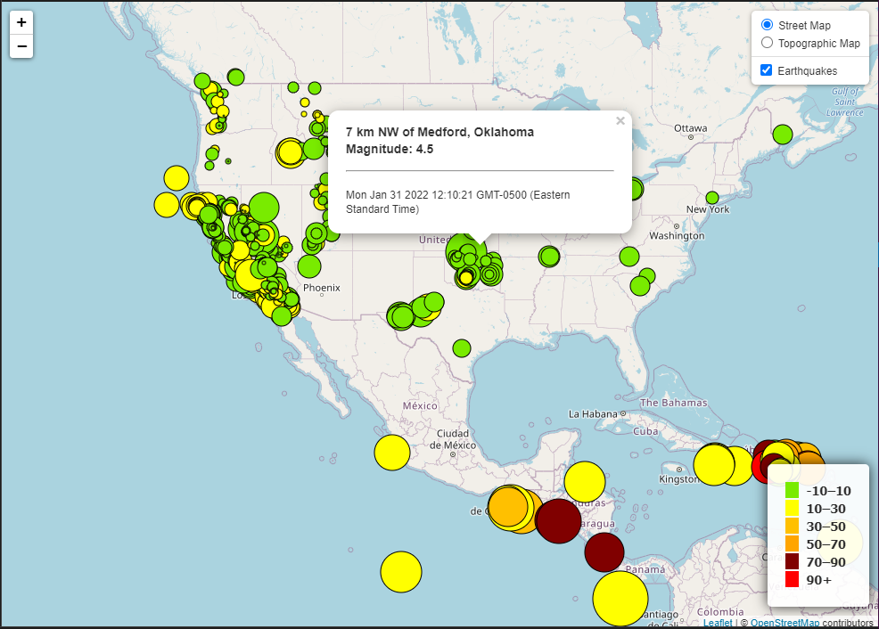
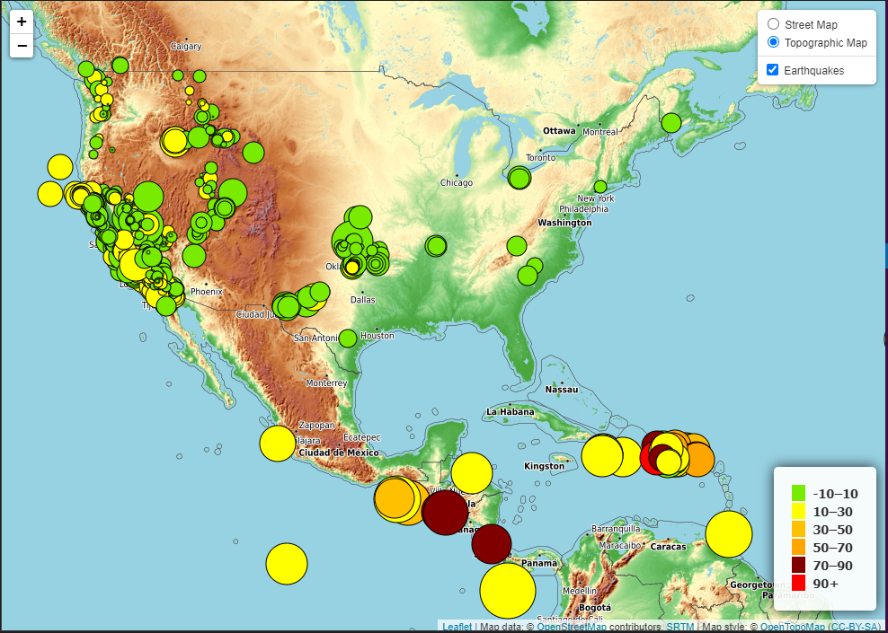

# Leaflet Homework: Visualizing Data with Leaflet

## Background

The goal the exercise was to build visualize earthquake data from the United States Geological Survey, or USGS for short using Leaflet.js, CSS and HTML. I was able to complete the Level-1 part.

## Level-1 Basic Visualization
Here are the steps involved:
1. Get the data from the USGS GeoJSON page.
2. Create a map using Leaflet that plots all of the earthquakes as markers based on their longitude and latitude.
3. The size and the color of the data markers depend upon the magnitude and the depth of the earthquake. 
4. Earthquakes with higher magnitudes appear larger and earthquakes with greater depth should appear darker in color. 
5. The earthquakes with the highest magnitude was given a Deep Red color indicative of severity.
6. Popups are added that provide additional information such as, location of the earthquke, date, time and magnitude about the earthquake when a marker is clicked.
6. Legend that explains the colors in the context of the magnitude is also available on the bottom right hand corner.
7. Finally there are 2 layers to the map - Street Map and the Topographic Map. A control on the top right hand corner of the map allows you to toggle between them.

Below are the screenshots of the visualization.
### Street Map:

### Topographic Map:

